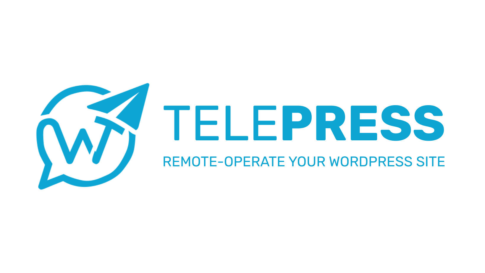

# WP Telepilot

WP Telepilot is a Telegram-first WordPress operations plugin. It lets authorized WordPress users link their Telegram account, inspect site state, and carry out short, structured operational tasks from chat without recreating all of `wp-admin` inside Telegram.

## What WP Telepilot does

- Securely links a Telegram user to a WordPress user with a short-lived one-time code.
- Supports both Telegram webhook mode and polling fallback mode.
- Provides transport diagnostics for webhook health, polling health, stale updates, send failures, and link attempts.
- Gives a Telegram control surface for:
  - site overview
  - posts
  - pages
  - comments
  - media
  - users
  - plugins
  - categories
  - tags
- Supports search and pagination for the main content and user modules.
- Adds a secure browser editing bridge for long-form post content when Telegram chat is not the right editing surface.
- Supports structured post, page, and user management actions including browser-based long-form post editing, role changes, password reset flows, and controlled deletes.
- Keeps media management read-only in Telegram for this release, with list, search, details, and open-in-browser flows.
- Supports richer taxonomy and plugin operations including term detail/edit flows and plugin update refresh from Telegram.
- Supports Telegram-side notification controls and safe site-setting updates for core fields like title, tagline, admin email, timezone, and date/time format.
- Supports Phase 7 hardening controls for log retention, stale-update handling, inbound rate limits, linking toggles, and uninstall cleanup behavior.
- Supports fuller comment workflows including status queues, search, detail views, reply posting, and safer destructive moderation flows.
- Formats Telegram responses for readability with clearer headings, spacing, inline tips, and code-style command examples.
- Uses confirmations for destructive actions and writes activity to the WP Telepilot audit log.

## Core commands

- `/start` starts onboarding.
- `/menu` opens the WP Telepilot command hub.
- `/site` shows the site overview and module shortcuts.
- `/help` shows the available command surface.
- `/users help` shows concrete user-management examples and syntax.
- `/chatid` reveals the current Telegram chat ID.
- `/link CODE` links Telegram to the current WordPress user.
- `/unlink` removes the Telegram link.

## Command reference

- Full command documentation is available in [COMMANDS.md](COMMANDS.md).
- A release-prep regression checklist is available in [QA-CHECKLIST.md](QA-CHECKLIST.md).
- The reference is grouped by scope such as Core, Comments, Posts, Pages, Media, Users, Plugins, Categories, and Tags.
- Each command entry includes syntax, an example, and expected behavior.

## Admin settings

From `WordPress Admin -> WP Telepilot`, you can:

- paste the Telegram bot token
- choose webhook or polling transport
- define the webhook secret
- restrict allowed chat IDs
- enable or disable user linking
- choose whether plugin data is preserved or deleted on uninstall
- inspect transport diagnostics
- inspect cron, queue, schema, and database readiness diagnostics
- manually poll Telegram
- refresh webhook status
- flush queued Telegram updates

## Linking flow

1. Install and activate the plugin.
2. Create a Telegram bot in BotFather.
3. Paste the bot token into WP Telepilot settings.
4. Save settings so WP Telepilot can register webhook details or switch to polling fallback.
5. Open your WordPress profile and generate a one-time link code.
6. Open a private chat with the bot and send `/link CODE`.
7. Use `/menu` or `/site` to begin operating the site.

## Security and reliability highlights

- Link codes are short-lived and stored server-side as hashes.
- Sensitive actions are restricted to private chats.
- Webhook requests validate the Telegram secret header.
- Duplicate Telegram updates are ignored.
- Stale Telegram updates are dropped.
- Polling uses a lock to avoid overlapping workers.
- Uninstall behavior is operator-controlled so site owners can preserve data by default or opt into full cleanup.
- Audit records are captured for linking, moderation, content actions, and Telegram delivery.

## Usability highlights

- The bot uses richer formatting so site summaries and lists are easier to scan.
- Module-specific help is available where syntax is not obvious.
- Command discovery is guided through `/menu`, `/help`, `/site`, and inline keyboards instead of relying only on memorized commands.

## Requirements

- WordPress 6.6 or newer
- PHP 8.0 or newer
- HTTPS for webhook mode

## Local planning docs

- Product and planning notes are kept locally in `docs/`
- The `docs/` tree is git-ignored on purpose

## Current direction

WP Telepilot is designed around one principle:

> Telegram is for awareness, decisions, and short actions. WordPress remains the place for long-form editing, visual design, and complex configuration.
